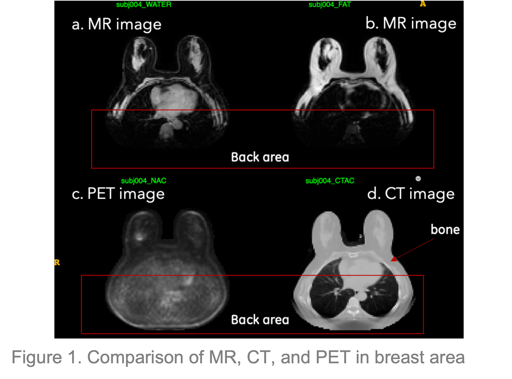
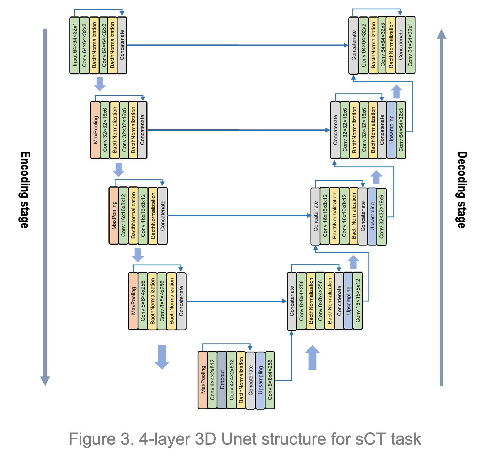
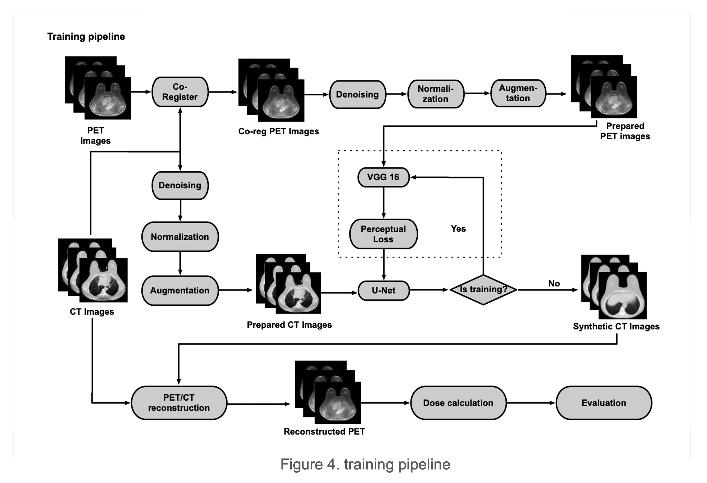

# Synthetic CT generation from PET images for attenuation correction with Deep Learning methods
### CS766 2022 Spring project
### Xue Li, Ni Li

## Introduction and Motivation 
There are many different medical image modities for different use. For example, MR images have better soft tissue contrast, so we usually do MR scan to observe the soft issue; while PET images are sensitive to disease, so it is widely used for disease detection especially in the early stage; as for CT, it can provide accurate bone information which is required for later treatment planning, like PET attenuation correction. So CT is a necessary part during traditional clinical treatment, but the problem with CT is also obvious that patients are exposed to radiation during CT scans which is not expected. To avoid that, researchers are trying to synthesize CT from other modality images. 

Positron emission tomography (PET) and positron emission mammography (PEM) using 18Ffluorodeoxyglucose
(FDG) have been shown to have high specificity for breast cancer detection. However, breast-specific PET is not routinely utilized; instead, magnetic resonance imaging (MRI) is used clinically for extent of disease evaluation and neoadjuvant therapy response assessment for patients with newly diagnosed breast cancer. The recent availability of simultaneous PET/MR scanners offers the benefit of combining the high sensitivity for the detection of breast cancer provided by contrast-enhanced MR imaging with functional imaging using PET.

However, for the breast area, there are two problems for MR images generated by clinical PET/MR system, the missing bone information and back truncation problem as shown in Fig 1. The former one is due to the technical challenges of obtaining positive MR signal in bone in clinical PET/MR system while the latter one is caused by position patient are placed during imaging to get better breast images. Both of two problems will lead to errors during breast cancer treatment, which is not desired. In current pipeline, MR images are used to generate synthetic CT (sCT) images for later attenuation correction of PET images. Therefore, the missing bone and back truncation problems will happen to sCT as well. As a result, inaccurate attenuation correction of PET images is calculated, and there is up to 20% error for the final treatment plan.
Since we observed that PET images don’t have such missing bone and back truncation issues, we decided to use PET images for sCT generation for later PET attenuation correction. However, there are two potential problems for PET, lower spatial resolution and little anatomic information, which may make it challenge to get accurate sCT as well. 

As the pipeline shows, the key to solve this problem is to get accurate sCT images with bone and back information. Recent advances in deep learning (DL) have demonstrated great success in accomplishing image processing tasks, like image transfer, converting images from one domain to anther domain. These methods have
been applied to medical imaging successfully, like synthetic CT generation from MR images. Therefore, we want to train a DL model with breast dataset to get accurate sCT images directly from PET images which don’t have such a problem mentioned.
In this project, we developed a model based on Unet to synthesis CT images directly from PET images. The performance of our model outperformed the current pipeline. 

## Project Proposal

https://github.com/nili72/CS766-project-2022-team19/blob/8af7fd457c0f37dfafecd042d10a0d64a67d8518/Report/CS766_ProjectProposal.pdf

## Midterm Report 

https://github.com/nili72/CS766-project-2022-team19/blob/8af7fd457c0f37dfafecd042d10a0d64a67d8518/Report/CS766_midterm_report.pdf

## Presentation video
https://drive.google.com/drive/folders/1pvh_KKiJCi5xug-S3EHWnjHVQ9QIS3DP?usp=sharing
## Project code repo
https://github.com/nili72/CS766-project-2022-team19/tree/gh-pages/Code

## Project Timeline

| When                 | Task                                                                   | 
|:---------------------|:-----------------------------------------------------------------------|
| Feb 24               | Project Proposal submission                                            | 
| Feb 25 - Mar 2       | Get familar with UNet structure and training                           |
| Mar 2- Apr 5         | Build pipeline and train the UNet model                                | 
| Apr 5 - Apr 21       | Tune the model to improve its performance, try other models            | 
| Apr 21- May 5        | Summarize the evaluation and comparison, make presentation and webpage | 

## Current State of Art
Recently, a number of studies have used deep learning and convolutional neural networks to create sCT images[1-3]. Among the many kinds of convolutional neural networks, the Unet[4] has shown outstanding performance in medical image segmentation and synthesis. More recently, generative adversarial networks (GANs)[5] have become popular in creating realistic synthetic images. sCT images of pelvic, liver, brain, and head and neck regions have been produced by GANs and their variants[6-10]. However, current studies focus more on MR-to-CT than PET-to-CT due to the potential problems mentioned in the introduction section, and very few studies show the transfer from PET images to sCT images [11]. Also, these studies were conducted based on the brain pelvis head-and-neck, abdomen datasets in which there is no truncation problem for both MR and CT images. This implies the challenges of generating sCT directly from PET for the breast area.

## Dataset and Preprocess
The breast dataset contains 23 subjects in total, including CT images and PET images. CT images have the
size of 192x192x47 with spacing information (3.646mm, 3.646mm, 3.27mm) while PET images have the size of 192x192x89 with spacing information (3.125mm, 3.125mm, 3.78mm).

The noise of the CT images and PET images were removed firstly. Then, PET images were registered to CT images to have the same data size and spacing information. The HU value of CT images is cropped into the range of [-1000, 2000] according to the meaning of HU value. Both CT and PET images are normalized. The normalization for CT is shown as follows:

The normalization for PET is simple. Just divide by 1500. Since not all the CT images have perfect back images, we cropped the imperfect back area for both CT and PET images.

## Approach
There are 24 cases in the breast dataset. We used 18 cases for training, 3 for validation, and 3 for testing. 8-folder cross validation was conducted to produce accurate evaluation.

### Model and Pipeline
Unet and GAN-related models are the most common models in the field of sCT generation. Here, we developed a 4-layer patch-based 3D Unet model for this task as Fig.3 shows. The patch size we used for training is 64x64x32. The input is PET images with cube size (64x64x32), and the ground truth is the corresponding CT images with same cube size. 
Three different loss functions were tried, including MAE, MSE, and perceptual loss. The first two are pixel-based while the last one is feature and style based.

The pipeline of our study is shown in Figure 4. First, PET images were registered to CT images. And then data processing methods were applied to both PET and CT images. After that, processed PET and CT images were used for training. The vgg part is especially for perceptual loss. Pretrained VGG was used to capture the difference between sCT and CT, so that perceptual loss can be calculated to improve the model. Once the sCT was predicted, it was used for PET/CT reconstruction to get the corrected PET for later dose calculation in different tumor area. Finally, the absolute percent error between dose calculation from CT-based and sCT-based reconstructed PET was computed for final evaluation.

## Evaluation

### Evaluation of sCT images
Eight-fold-cross-validation was performed to evaluate model performance for both the UNet and UNETR models. The 23 patients were randomly divided into eight groups, seven groups of three patients and one group of two cases. For each cross-validation fold, seven groups were used for training and validation, and one group was left for testing. Finally, the synthesized sCT images were generated case by case and compared with the original CT images. Three measures were utilized to evaluate the difference and similarity between CT and sCT images: mean absolute error (MAE), peak-signal-to-noise-ratio (PSNR), and normalized cross-correlation (NCC). The formulas are shown as follows.

### Attenuation correction and Evaluation
After getting the sCT images, PET/CT based reconstruction will be run to get reconstructed PET. There are four kinds of them in total: one from CTAC, the ground truth, one from sCT generated by MR images in current pipeline, one from sCT generated by DL UNet model, and one from sCT generated by DL UNETR model. Once the reconstructed PET images are got, the treatment dose for each patient in each tumor area can be calculated. There are mainly tumor areas, including Breast, FGT, Liver, Blood, and LN. The average of absolute dose calculation percent error for each type of tumor will be used to evaluate each model.  N is the number of patients. 

## Results
The sCT images generated by each model is shown as Fig. 5. The first row shows the ground truth CT image slices and the other rows shows the sCT images predicted from test PET images by our three loss models. All those sCT images look good and very similar to the ground truth images. It's worth noting that UNet with mae loss model produces better tissue contrast than the other two models, while the UNet with perceptual loss model seems produces CT images with bone structures closer to the ground truth.

The eight-fold cross validation results are shown in Fig. 6. No obvious difference were found between them, which confirms our conclusion made by observation. 

The absolute percent error for each tumor is shown in the table of Figure 7. The left image shows the annotation of different tumor sites on the reconstructed PET images, and the table contains the percent errors of dose calculation on different tumor sites, where the last column shows the percent error of conventinal PET/MR pipeline. UNet with MAE and MSE models out-perform the conventional pipeline in all the area, but the UNet with Perceptual loss model performes worse than the baseline for some areas. Overall, UNet with MAE loss model is the best model for our study of sCT from PET on 3D breast images dataset.

## Conclusion and Discussion
We developed a pipeline with a UNet model for the synthesis of CT images from PET images to overcome the problems of missing bone and back truncation exsist in MR images. We confirmed the performance of the UNet model with MAE and MSE loss models outperforms the conventional pipeline. Nevertheless, there are still some limitation of this model. The pipeline requires precise PET-CT image registration, but the ANTsPy package we adopted is not robust enough. Besides, the annotation positions are taken from CT images, which makes the mis-registration of images a bigger problem for the dose calculation at different tumor areas.
To get rid of the image registration problem, we also tried the Cycle GAN [12] and UNetR [13] models. However, we did not have enough time to tune those models well enough to outperform the conventional pipeline. We'll keep work on the improvement of those models.

## References
1. Dinkla AM, Florkow MC, Maspero M, et al. Dosimetric evaluation of synthetic CT for head and neck radiotherapy generated by a patch-based three-dimensional convolutional neural network. Med
Phys. 2019;46:4095-4104.
2. Liu F, Yadav P, Baschnagel AM, McMillan AB. MR-based treatment planning in radiation therapy using a deep learning approach. J Appl Clin Med Phys. 2019;20:105-114.
3. Bird D, Scarsbrook AF, Jonathan Sykes J, et al. Multimodality imaging with CT, MR and FDG-PET for radiotherapy target volume delineation in oropharyngeal squamous cell carcinoma. BMC
Cancer. 2015;15:844.
4. Ronneberger O, Fischer P, Brox T. U-Net: Convolutional networks for biomedical image segmentation. In: Navab N, Hornegger J, Wells W, Frangi A, eds. Medical Image Computing and Computer-Assisted Intervention—MICCAI 2015. Springer; 2015:234-241.
5. Goodfellow IJ, Pouget-Abadie J, Mirza M, et al. Generative Adversarial Networks. arXiv:1406.2661 [stat.ML]. June 2014. Available at: https://arxiv.org/abs/1406.2661. Accessed: April 14, 2020.
6. Qi M, Li Y, Wu A, et al. Multi-sequence MR image-based synthetic CT generation using a generative adversarial network for head and neck MRI-only radiotherapy. Med Phys. 2020;47:1880-1894.
7. Kazemifar S, McGuire S, Timmerman R, et al. MRI-only brain radiotherapy: Assessing the dosimetric accuracy of synthetic CT images generated using a deep learning approach. Radiother Oncol. 2019;136:56-63.
8. Lei Y, Harms J, Wang T, et al. MRI-only based synthetic CT generation using dense cycle consistent generative adversarial networks. Med Phys. 2019;46:3565-3581.
9. Liu Y, Lei Y, Wang Y, et al. MRI-based treatment planning for proton radiotherapy: Dosimetric validation of a deep learning-based liver synthetic CT generation method. Phys Med Biol. 2019;64:145015.
10. Liu Y, Lei Y, Wang Y, et al. Evaluation of a deep learning-based pelvic synthetic CT generation technique for MRI-based prostate proton treatment planning. Phys Med Biol. 2019;64: 205022.
11. X. Dong et al., “Synthetic CT generation from non-attenuation corrected PET images for whole-body PET imaging,” Phys. Med. Biol., vol. 64, no. 21, p. 215016, Nov. 2019, doi: 10.1088/1361-6560/ab4eb7.
12. Zhu, Jun-Yan, et al. "Unpaired image-to-image translation using cycle-consistent adversarial networks." Proceedings of the IEEE international conference on computer vision. 2017.
13. Hatamizadeh, Ali, et al. Unetr: Transformers for 3d medical image segmentation. Proceedings of the IEEE/CVF Winter Conference on Applications of Computer Vision. 2022. 
14. Boulanger, M., et al. "Deep learning methods to generate synthetic CT from MRI in radiotherapy: A literature review." Physica Medica 89 (2021): 265-281.
15. Wang, Tonghe, et al. "A review on medical imaging synthesis using deep learning and its clinical applications." Journal of applied clinical medical physics 22.1 (2021): 11-36.

